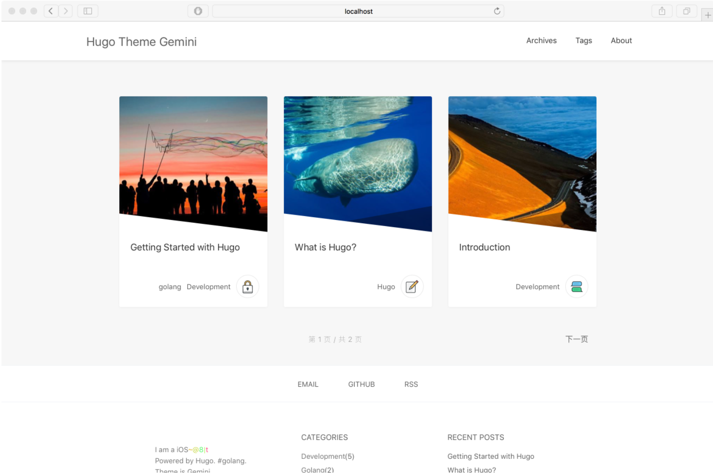

# Gemini theme for hugo

Gemini is a clear and responsive theme for [hugo](http://gohugo.io/). Ported from [Pinghsu Theme](https://github.com/chakhsu/pinghsu), a Typecho theme.

[Demo](https://mjyi.github.io/Gemini/)



## Installation

```
cd ~/path/themes
git clone https://github.com/mjyi/Gemini.git
```

## Configuration

**config.toml**
```toml
baseurl = "https://mjyi.github.io/Gemini/"
title = "Hugo Theme Gemini"
canonifyurls = true
paginate = 3
languageCode = "en-us"
MetaDataFormat = "yaml"
theme = "Gemini"
googleAnalytics = "" # delete or comment to disable Google Analytics JS generation
disqusShortname = "mjyi-io" #delete or comment to disable Disqus comments

[params]
  Keywords = ""
  Author = "Gemini"
  recentPostCount = 7
  intro = ["I am a iOS Developer", "Work in Hangzhou"]

[[params.social]]
  title = "Email"
  url = "mailto:itxuz@itxuz.com"
[[params.social]]
  title = "Github"
  url = "https://github.com/mjyi"
[[params.social]]
  title = "RSS"
  url = "" #default index.xml


[[menu.main]]
  name = "Archives"
  url = "/post/"
  weight = -200
[[menu.main]]
  name = "Tags"
  url = "/tags/"
  weight = -180
[[menu.main]]
  name = "About"
  url = "/about"
  weight = -160
```

**Post Detail Configuration**

in archetypes/post.md

```
+++
tags = ""
categories = ""
image = "/images/thumbs/0.jpg" #set a picture, or randomly select one in the folder images/thumbs
draft = true
comments = true
toc = true
author = ""
author_url = ""
+++

```


